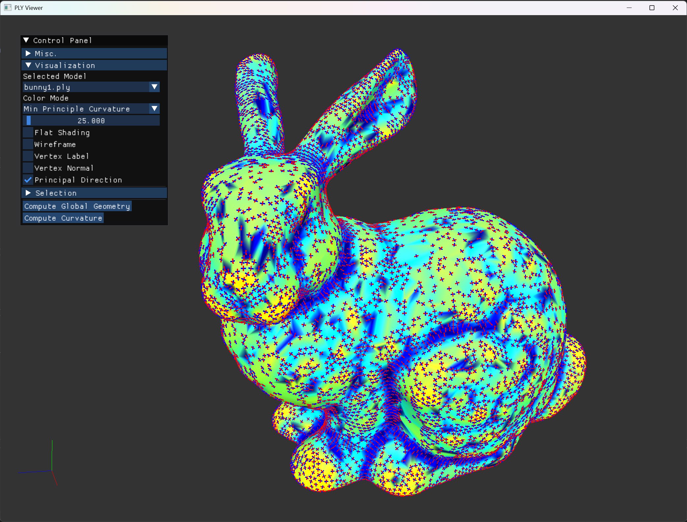

# Assignment3: DiagnosePLY
https://drive.google.com/file/d/15KU4mqJIy1flMT16EO8w8zKPrB5mesF4/view?usp=sharing

## Non-manifold Component Detection

1. Implement `isNonManifoldVert` in `MeshProcessor` and demonstrate the non-manifold vertices of `nonmanifold.ply`. **[2 points]**
2. Implement `isNonManifoldEdge` in `MeshProcessor` and demonstrate the non-manifold edges of `nonmanifold.ply`. **[2 points]**
3. Implement `findHoles` in `MeshProcessor` and demonstrate the holes of `sphere_holes.ply`. **[2 points]**
4. What challenges in mesh processing can arise when dealing with non-manifold surfaces? **[2 points]**

## Topological Evaluation

1. Implement the following functions in `MeshProcessor`:
   - `calcEulerCharacteristic`  
   - `calcAngleDeficit`  
   - `calcTotalAngleDeficit`  
   - `calcValenceDeficit`  
   - `calcTotalValenceDeficit`  
   **[each 1 points]**

   - The Euler Characteristic is given by  $V - E + F$

   - The **valence deficit** of a vertex is defined as six minus its valence (i.e., the number of incident edges). The **total valence deficit** of a model is the sum of the valence deficits of all vertices.

   - The **angle deficit** of a vertex is defined as $2\pi$ minus the total angle around the vertex from all incident triangles; the **total angle deficit** of a model is the sum of the angle deficits of all vertices.

2. Count the handles of the meshes and fill in the table below.**[4 points]**

   | PLY         | V - E + F | Handles | Total valence deficit | Total angle deficit |
   |-------------|-----------|---------|-----------------------|---------------------|
   | sphere      |           |         |                       |                     |
   | icosahedron |           |         |                       |                     |
   | bunny1      |           |         |                       |                     |
   | hand        |           |         |                       |                     |
   | torus       |           |         |                       |                     |
   | dragon      |           |         |                       |                     |
   | feline      |           |         |                       |                     |
   | happy       |           |         |                       |                     |
   | heptoroid   |           |         |                       |                     |

3. Is there a relationship among the above quantities (Euler characteristic, number of handles, total valence deficit, and total angular deficit)? Prove the relationship of your statements. **[3 points]**

4. You now have two measures of flatness: valence deficit and angle deficit.  
   - Where in the mesh do you tend to see irregular vertices, and where do you see vertices with a total interior angle much more or less than $2\pi$?
   - How do these two types of vertices position with respect to each other?  
   - Can you make some hypotheses and validate them?  
   Use your program to facilitate the investigation (note you can use the color mapping mode of valence deficit or angle deficit). **[3 points]**

# Geometric Evaluation

1. Implement the following functions in `MeshProcessor`: 
   - `calcVolume`  
   - `calcTotalFaceArea`  
   - `calcVertNormals`  
   - `calcVertArea`  
   - `calcInteriorAngle`  
   - `calcDihedralAngle`  
   **[each 1 points]**

2. Implement the following functions in `MeshProcessor`: 
   - `calcGaussCurvature`  
   - `calcMeanCurvatureNormal`  
   - `calcMeanCurvature`  
   - `calcPrincipalCurvature`  
   **[each 1 points]**

3. Implement the following functions in `MeshProcessor`:  
   - `calcCurvatureTensor`  
   - `calcVertLocalframe`  
   **[each 1 points]**

4. Display the vertex area, Gaussian curvature, mean curvature, maximum/minimum principal curvature, and principal direction for `torus.ply` using color mapping modes. 
   Can you describe the local shape of the torus based on these curvature measures? **[3 points]**

5. Apply the evaluations on `bunny1.ply`, `bunny2.ply`, and `bunny3.ply`:  
   - What are the volume of the meshes? **[2 points]**
   - Which one is more regular? Why? **[2 points]**
   - Which one do you prefer? Why? **[2 points]**
